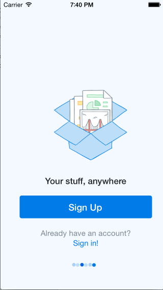

dropBoxFlow
===========

Week 1 Homework

Time spent: About 6 hours spent in total, a large chunk of that was stuck on the scrollView, which I don't think we had gone over yet.

Completed Requirements (3/3 Required, 2/3 Optional)

  completed: User can tap through the 3 welcome screens.
  
  completed: User can follow the create user flow.
  
  completed: User can follow the sign in flow.
  
  Optional:  Add UITextFields for the forms so you can actually type in them and handle dismissing the keyboard.
  
  Optional: You should be able to swipe through the welcome screens instead of just tapping them.
  

